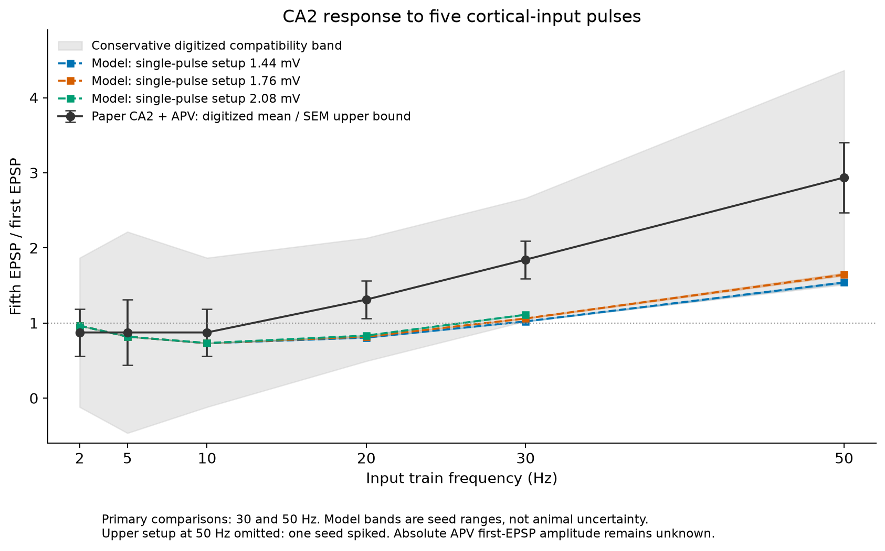
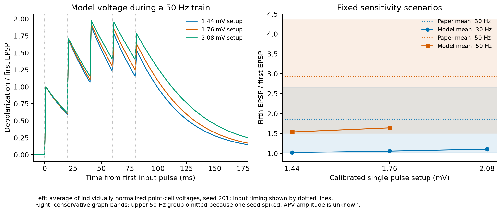

# What this experiment established

**We have not established biological replication of the paper.** The frozen
model produces more summation at higher input frequencies, which resembles one
qualitative feature of the published CA2 response. The central setup passes the
broad, predeclared comparison bands at 30 and 50 Hz, but predicts ratios about
42–44% smaller than the published averages. The result is conditional
compatibility with a limited observation, rather than a close quantitative match
or validation of the full circuit.

In simple words: we gave the model five identical input pulses and asked how
large the last response was compared with the first. Faster pulses overlap more
in the model, but the growth is weaker than in the paper. Wide uncertainty bands
allow the central setup to pass our limited check. That pass does not establish
that the model is an accurate substitute for an animal experiment.

## Primary results

The biological comparison is the CA2 **APV** arm of Figure 5H in
[Sun et al. (2021)](https://pmc.ncbi.nlm.nih.gov/articles/PMC8482869/), in which NMDA
receptors and inhibitory GABA receptors were blocked. The original observations
are from mice; network seeds and simulated cells here are not animals.
Published values below are approximate readings from the graph, not raw data.

| Single-pulse setup | Model ratio at 30 Hz | Model ratio at 50 Hz | Predeclared decision |
|---|---:|---:|---|
| 1.44 mV | 1.022 | 1.540 | Does not pass both: 30 Hz narrowly below band |
| 1.76 mV | 1.061 | 1.644 | Passes both broad bands, conditional on setup assumptions |
| 2.08 mV | 1.111 | Ineligible | One of five seeds spikes at 50 Hz; group cannot pass |
| Paper CA2 + APV | ≈1.844 | ≈2.938 | Digitized biological means, n = 5 |

At the central setup, the fifth response is about **6% bigger** than the first
at 30 Hz and **64% bigger** at 50 Hz. The paper's corresponding averages are
approximately **84% bigger** and **194% bigger**. The model means are 42.4% and
44.0% below the digitized means; these are descriptive errors, not significance
tests. Five new network seeds give ranges 1.057–1.069 at 30 Hz and 1.632–1.664
at 50 Hz. Those narrow ranges describe model topology variability, not
biological uncertainty.

The predeclared approximate compatibility bands are 1.025–2.663 at 30 Hz and
1.511–4.364 at 50 Hz. They combine graph-read SEM upper bounds, a small-sample
multiplier and pixel extraction error. They are deliberately conservative;
therefore passing them is a weak constraint and does not imply matching the
published central values. They are not exact confidence intervals or prediction
intervals for animals. Both the scoring rule and graph extraction were committed
before any five-pulse test.

The low setup misses the lower 30 Hz boundary by only about 0.0025 ratio units,
and some seeds fall above that boundary. Treat that as a borderline failure of
this fixed rule, not decisive biological disagreement. The predefined robust
mismatch criterion is **not met**. Only the central setup passes both endpoints;
the experiment does not support either broad validation or a robust rejection
across all possible setups.

Black points are digitized paper means. Gray shading is the approximate
compatibility band. Colored curves are model means; their small shaded ranges
represent five network seeds. The upper 50 Hz group is omitted because it
contains a spike. Other frequencies are descriptive, not extra held-out success
criteria. Negative lower bounds at low frequencies are an artifact of the
symmetric conservative construction and have no biological interpretation.

## Setup and calibration

A direct MEC LII stellate → CA2 pyramidal pathway was isolated from the existing
Hippocampome-derived model. The assay contains 128 CA2 point cells and a pool of
10,818 prescribed input cells. It does not contain CA3, CA1, an entorhinal network,
recurrence, or interneurons. This reduction approximates the pharmacologically
isolated EPSP assay; it does not reproduce the whole slice. The original
perforant-path electrode does not establish that precisely this single exported
cell class was recruited.

The exported intrinsic parameters and direct-pathway conductance/STP values were
left unchanged. NMDA conductance is zero and inhibition is absent, approximating
the selected drug-blocked arm. The export's connection-probability fallback is
retained. The official exporter code indicates that the `CARLsim_default` flag
refers to this fallback; it does **not** by itself mark all synaptic dynamics as
generic defaults. The exact physiological source ancestry of this row, and the
deployed exporter revision, remain unverified. See `source_audit.json`.

The holding current was computed from the unchanged intrinsic model's equations
to settle near −70 mV. Afferent recruitment was the only input fit. Single pulses
at seeds 101–102 selected:

| Target first EPSP | Active afferents | Calibration mean | Held-out mean first EPSP |
|---|---:|---:|---:|
| 1.44 mV | 1,859 | 1.451 mV | 1.428 mV |
| 1.76 mV | 2,281 | 1.770 mV | 1.742 mV |
| 2.08 mV | 2,704 | 2.083 mV | 2.059 mV |

Calibration agreement is an imposed setup constraint, not evidence of successful
prediction. The three targets transfer Figure 4's weak CA2 first-response mean
± SEM to Figure 5's APV arm. **That transfer is unverified:** the absolute initial
CA2 APV amplitude in Figure 5 was not recovered. These are three operating
scenarios, not a known range for that preparation or biological variability.

Testing used five synchronous pulses at 2, 5, 10, 20, 30 and 50 Hz with seeds
201–205. First pulse: 5,100 ms; delay: 1 ms; integration: RK4 with 20 substeps/ms.
At 30 Hz, the millisecond input grid gives times 5,100, 5,133, 5,167, 5,200 and
5,233 ms. All exact schedules and run configurations are retained. No intrinsic
or synaptic retuning followed train outcomes.

The preparation's temperature (31–32°C), morphology, dendritic conductances and
stimulation geometry are not represented explicitly. An effective point-cell
parameter fit is not a reconstruction of a particular recorded neuron.

## Verification, exclusions and measurement limits

All **120 held-out runs** completed: 90 nominal tests and 30 paired numerical
checks with 40 substeps/ms. Every raw voltage/spike file was re-read and checked
against its checksum, configuration and prescribed input events. All 30 pairs
passed the declared gates on mean ratios, mean peak amplitudes, eligibility and
spike counts. For the 29 eligible pairs, the largest mean-ratio change was 0.00164
and the largest mean-peak change was 0.00659 mV, well below the fixed limits of
0.05 and 0.1 mV.

Two of the 120 runs are ineligible: the nominal and precision versions of the
same upper-level, 50 Hz, seed-205 setup. Cell 12 fired once at 5,229 ms with
20 substeps and 5,230 ms with 40 substeps. Both recordings are retained. Across
all pairs, maximum mean-ratio change was 0.02661 and maximum mean-peak change
0.09095 mV. The ineligible pair's individual-cell ratio changed by 3.533 and its
spike time changed by 1 ms. The declared gates concern population means; they
do **not** establish numerical convergence of every cell or precise spike timing.

The upper 50 Hz all-run mean remains in the JSON audit record, along with its
ineligibility flag. It contains a spike and is **not a valid subthreshold EPSP
comparison**. We do not discard the spiking seed to make the condition pass.

The primary measurement takes every pulse peak relative to the same prestimulus
baseline, then divides by that cell's first peak. This includes the residual
voltage from earlier pulses. The convention was inferred from the paper's scaled
traces; the authors' analysis implementation was not recovered. As a diagnostic,
measuring only the extra increment above the voltage immediately before each
pulse gives a very different result: for central seed 201 at 50 Hz, the ratio is
0.359 rather than the primary 1.632. This diagnostic was predeclared but does not
replace the primary score. It shows why exact agreement on the measurement
convention is necessary before claiming replication.

The trace panel shows mean normalized model voltages for seed 201 only, without
asserting that they reproduce a recorded biological waveform. The final peak
includes earlier responses that have not fully decayed. Separating the role of
short-term synaptic dynamics from membrane integration would require a new,
prospectively defined intervention experiment.

One earlier single-pulse setup attempt had native exit status 0 but failed in
the recording reader: this backend writes the warmup to disk even when the
in-memory monitor is stopped. The reader was repaired before train testing; the
original attempt, full file and log remain in the archive. That was a software
setup failure, not evidence about biology. There were no failed native test exits
or warning lines in the assay logs. Recorded legacy backend compilation warnings
remain in its source metadata. The assay used GPU integration, not the warned
CPU integration paths.

## Answer to the replication question

**Selected qualitative feature:** reproduced within the reduced model—greater
EPSP summation at higher frequency in the drug-blocked direct-input assay.

**Selected quantitative endpoints:** conditional compatibility at the central
setup under the prospectively fixed, broad graph bands. The means substantially
underestimate the published averages. This is limited evidence, and the outcome
is not robust across the three declared operating scenarios.

**Strict biological replication or full-paper replication:** not established.
Unknown APV starting amplitude, unresolved parameter ancestry and measurement
convention, and omitted preparation mechanisms prevent that conclusion. The CA1
comparison, NMDA-on arm and naturalistic sequence were not tested. No inference
about behavior or CA2's general function follows from this result.

The next useful step is to obtain the numerical Figure 5H responses, exact
initial amplitudes and analysis definition, and trace the selected Hippocampome
synaptic fit to its source experiments. Then define a new matched protocol
without tuning on its held-out responses. If further calibration is needed, use
separate data and reserve an independent condition or dataset for validation.

## Traceability

- Prospective plan/model commit: `a249457`.
- Recording-reader repair: `9b10f20`.
- Analysis specified before trains: `e9efe8b`.
- Calibrated configuration frozen before trains: `d58db6f`.
- `protocol.json`, `source_targets.json`, `source_audit.json` and
  `frozen_configuration.json` contain the exact definitions and scientific hashes.
- `evidence/` contains all individual results, run configurations, numerical
  checks, exclusions, figure traces, hardware record and raw-file manifest.
- `evidence/archive.json` identifies the full versioned raw workspace, including
  the original executable, calibration and retained setup attempt.
- `reproduce.md` explains checking the compact record, re-analyzing the raw data,
  and launching fresh GPU runs. Figures are independently reproducible from the
  compact evidence; no animal recordings are represented as simulation outputs.
