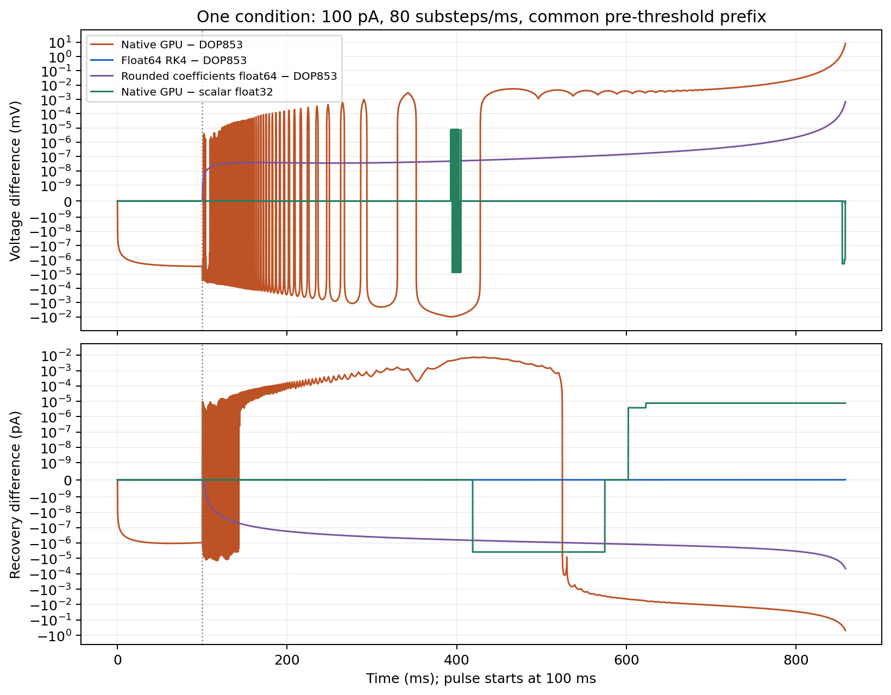

# Bounded pre-reset diagnostic result

The selected 100 pA, 80-substep condition localizes the dominant pre-first-spike drift to accumulated float32 operation rounding. Independent float64 RK4 agrees with the refined DOP853 reference; an explicitly rounded float32 RK4 closely follows the retained actual GPU trajectory. This is post-hoc engineering evidence for one condition. The original full spike/reset numerical verification **remains failed**.

The design was committed before new integrations at `bff3d5ffd1e08ac46dbea3b95e9cade94f9f99bc`. All five runs completed, with exact 100 ms stimulus transition and original float32 parameters, initial state and currents. No new GPU run, backend change, model change or fitting occurred. Per-substep states cover 0–858.4875 ms; comparisons stop at 858.475 ms, the lower endpoint of the earliest crossing bracket. The native reset ends at 858.5 ms and is excluded from this smooth diagnostic.

| Comparison on common pre-threshold prefix | Maximum voltage difference (mV) | Maximum recovery difference (pA) |
|---|---:|---:|
| DOP853 tolerance/maxstep refinement | 7.377e-9 | 2.932e-10 |
| Standard float64 RK4 versus tight DOP853 | 1.455e-10 | 1.516e-11 |
| Float64 RK4 with GPU-rounded coefficients versus tight DOP853 | 6.999e-4 | 4.549e-5 |
| Native GPU versus tight DOP853 | 8.141615 | 0.492978 |
| Native GPU versus explicit float32 scalar RK4 | 7.629e-6 | 7.629e-6 |

Reference refinement meets the frozen engineering state reliability criterion of 1e-7 for both components. The nominal float64 RK4 timestep is sufficiently accurate in this smooth prefix. Joint rounding of reciprocal capacitance, timestep and one-sixth coefficients produces a much smaller difference than the native trajectory; it does not explain the dominant drift alone. Explicit scalar float32 operation rounding follows the GPU within the listed bounds and reproduces the same sampled first-crossing bracket [858.475,858.4875] ms and interpolation estimate 858.485118959 ms. The other smooth variants have not crossed by the fixed stopping time; this diagnostic does not extend their runs to locate later crossings.

Native versus tight DOP853 first exceeds the descriptive 1e-5 voltage threshold at 100.025 ms, and the recovery threshold at 104.0875 ms. These are sampled exceedance times, not the first nonzero difference or replacement acceptance criteria. Initial states match exactly. DOP853 allows the tiny baseline drift caused by rounded parameters/current; the float32 trajectory can round away small updates. The largest voltage difference occurs near the rapidly rising first spike. The earlier full hybrid verification separately recorded a 0.338039 ms first-crossing discrepancy at this condition; this smooth prefix diagnostic does not recompute or waive that event-time failure.

The result supports float32 operation rounding as the dominant source in this fixed prefix. It does not isolate a particular GPU instruction or prove exact compiler/FMA equivalence: the scalar implementation omits FMA, and residual differences of up to 7.63e-6 remain. It also does not diagnose all current/timestep conditions or the subsequent reset/refractory amplification. No further condition or backend repair is performed.

The [compact record](prefix_results.json) includes all ten comparisons, RMS/endpoint differences, first-exceedance telemetry, nine checkpoints for every variant, crossing brackets and raw CSV checksums. The uniquely named diagnostic archive contains all five full CSV state histories, the four unchanged native inputs, execution record and frozen design. The original raw archive and scientific outputs remain unchanged. The [post-hoc biological comparison](../posthoc_biological_comparison/report.md) is separately exploratory; this diagnostic does not establish biological validation.
