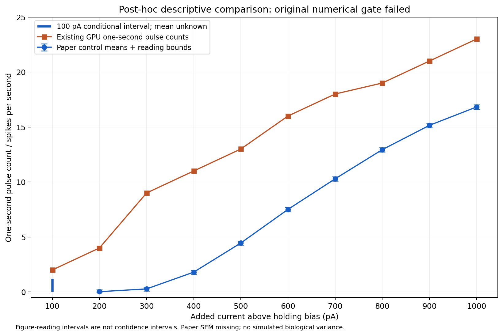

# Post-hoc biological comparison

**Explicitly authorized exploratory interpretation after the original numerical gate failed.** This does not reopen the gated primary analysis or establish biological validation. Original report, model, target and thresholds remain unchanged.

| Current (pA) | Native pulse count | Frozen paper mean (Hz) | Paper reading interval (Hz) | Native minus paper (Hz) | Whole-recording count |
|---:|---:|---:|---:|---:|---:|
| 100 | 2 | unidentified | [0.000, 1.200] | [+0.800, +2.000] | 2 |
| 200 | 4 | 0.025 | [0.000, 0.192] | [+3.808, +4.000] | 4 |
| 300 | 9 | 0.276 | [0.102, 0.450] | [+8.550, +8.898] | 9 |
| 400 | 11 | 1.801 | [1.609, 1.951] | [+9.049, +9.391] | 11 |
| 500 | 13 | 4.453 | [4.257, 4.611] | [+8.389, +8.743] | 14 |
| 600 | 16 | 7.509 | [7.312, 7.684] | [+8.316, +8.688] | 16 |
| 700 | 18 | 10.288 | [10.081, 10.471] | [+7.529, +7.919] | 18 |
| 800 | 19 | 12.941 | [12.729, 13.135] | [+5.865, +6.271] | 20 |
| 900 | 21 | 15.151 | [14.929, 15.348] | [+5.652, +6.071] | 21 |
| 1000 | 23 | 16.821 | [16.599, 17.029] | [+5.971, +6.401] | 23 |

The existing native count exceeds every frozen control-reading interval. Conditional ten-current RMSE is 6.8434–7.2053 spikes/s, signed mean difference +6.3928–6.8383, and maximum absolute difference 9.0489–9.3910. These bounds propagate figure-reading/occlusion uncertainty, not population uncertainty. There is no ten-point estimate because the 100 pA mean remains unidentified.

Descriptively the frozen model fires more at low current and remains above the control mean at high current: greater somatic excitability under this assay. The largest visible difference is around 400 pA (11 versus 1.801 spikes/s). At 1000 pA it is 23 versus 16.821. This is a mismatch of an individual fitted deterministic neuron with a population mean curve, not evidence that every experimental cell disagrees or that Hippocampome generally fails. Counts were stable across all three native timesteps, useful limited engineering evidence; failed timing/recovery-state gates still prevent a validated biological interpretation.

Whole-recording counts include one postpulse event at 500 and 800 pA: 14 versus 13 pulse events, and 20 versus 19. The author code searches the entire imported row, but its imported span is unknown. Either window changes those comparisons; neither is assumed to be the biological truth. No 6 ms exclusion or pulse-endpoint ambiguity changes the existing counts.

The original conditional 100 pA [0,1.2] interval is preserved. A later [0,0.4] geometric bound is source-only sensitivity, not substituted here. Figure SEM endpoints remain missing. The supplemental 17.16 ± 0.6439 Hz statistic is mean per-cell maximum firing, not automatically the 1000 pA mean.

The target comprises 92 NON-PILO control cells from 48 mice, with control medications, slice/age/sex/strain conditions described in the frozen protocol. One fitted deterministic cell has no biological variance or SEM. The model was fitted to earlier evidence; differences in preparation and the model’s uncalibrated temperature dependence are unresolved, and no temperature compensation is introduced. No population p-values, equivalence margin, parameter fitting or current fitting is used. This comparison concerns intrinsic somatic firing counts only, not CA2 synapses, circuits or the paper’s seizure/network conclusions.
