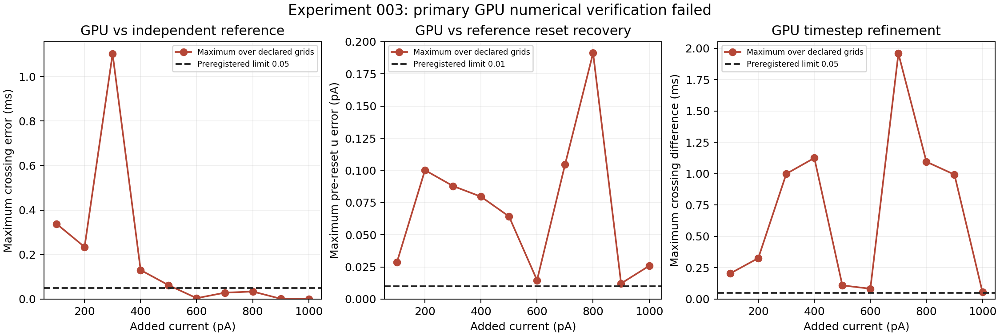

# Experiment 003: primary numerical gate failed

The unchanged GPU backend completed all 33 sweeps, but failed the preregistered independent numerical verification. **Biological discrepancy scoring and the agreement plot were not generated.** Ten paper residuals, signed mean error, RMSE and maximum biological error remain unavailable under this protocol. Stable spike counts do not override failed timing/reset-state criteria. This is an executed negative engineering result, not population biological validation.

The scientific protocol and target froze at `233b068cb7e22663b9ce551806e4a4e573a63872` before any neuron or reference output. All 66 clock-reference calculations then completed; writing the aggregate failed on a NumPy boolean. That failure remains in `revisions/003/original_failure.json`. A separately reviewed output-only recovery froze at `80049ab001aa6c4e444edb0bab018ded1897a8a9`, reused all pinned integrations and unchanged validators, and converted scalars only at serialization. It did not edit the backend, model, target, windows or numerical criteria. The immediate-reset diagnostic ran afterward under the original scientific preregistration.

All 33 native configurations, complete substep clocks, holding/baseline states, 414 resets and 29,002 refractory substeps passed structural checks and independent CSV review. Holding-only and baseline voltages remained exactly −70 mV in float32. Both tolerance settings agreed for every clock reference, and reference reset/holding audits passed. However, 23 of 33 native/reference crossing comparisons and 23 detection comparisons failed timing and/or pre-reset recovery criteria. Also, 23 of 33 production timestep comparisons failed. Maximum crossing difference across timesteps was 1.958398 ms; maximum detection difference was 2.000000 ms. The fixed engineering time limit was strictly below 0.05 ms, based on the source's 20 kHz sampling, and the same-grid pre-reset recovery limit was below 0.01 pA. These are engineering limits, not biological tolerances.

The native/reference gates are composite: **crossing-time limits failed in 9/33 cases, detection-time limits in 11/33, and pre-reset u comparison in 22/33**, giving 23/33 composite failures for each event representation. Native reset increments themselves passed. Cross-timestep comparisons do not compare reset u; crossing-time limits failed in 21/33 cases and detection-time limits in 23/33, giving 23/33 combined failures. Counts, order and window membership were stable in every comparison.

| Native substeps/ms | Observed state spacing (ms) | Maximum same-grid crossing error (ms) | Maximum same-grid detection error (ms) | Maximum same-grid pre-reset u error (pA) |
|---:|---:|---:|---:|---:|
| 20 | 0.05 | 1.101645 | 1.100000 | 0.191173 |
| 40 | 0.025 | 0.174882 | 0.175000 | 0.054359 |
| 80 | 0.0125 | 0.338039 | 0.337500 | 0.025811 |

Native state observations occur after every integration substep. Crossing times are linearly interpolated within those brackets, so their observation resolution is 0.05, 0.025 or 0.0125 ms; detection/reset times follow the recorded discrete clock. The 0.05 ms engineering criterion is applied to verified event-time error, not assumed from observation spacing. Several discrepancies exceed the whole observation bracket. The reference localizes crossings on high-accuracy continuous spans and retains the same delayed clock reset. Changing reference tolerance/maxstep changed crossings by at most 1.93×10⁻⁹ ms, so reference refinement did not account for the native disagreements.

Native RK4 uses float32 states, parameters, timestep and arithmetic; the independent DOP853 reference uses float64 integration of the actual recorded float32 configuration. They share parameter values but do not share rounding or integrator code. A threshold crossing lies between samples, whereas the native strict previous-voltage threshold test detects it on a later substep; reset then consumes an iteration. Refractory V/u freeze and counter decrement occur on the millisecond grid. Small trajectory differences can change the detection substep or its last-iteration branch, shifting later events by a millisecond-scale interval even while the one-second event total stays unchanged. This explains how timing and count conclusions can differ; identifying the precise cause of each discrepancy requires further engineering work. The 0.01 pA comparison concerns accumulated **pre-reset recovery state**, not the correctness of the audited u+=d reset increment. Refining dt did not give monotonic native/reference errors, so the finest grid alone does not establish convergence.

The plot takes maxima across all preregistered timesteps for each current. Complete records retain individual errors, reset states, crossing brackets, tolerance refinements, hashes and failures. No claim that this error pattern identifies a unique backend defect is made. The finite-precision GPU and the delayed millisecond refractory clock are candidates for further engineering investigation; no repair or relaxed criterion was selected after inspecting outcomes.

## Counts and measurement audit

Counts below are engineering telemetry from the finest GPU grid (80 substeps/ms) and the separately verified immediate-reset diagnostic. They are not scored against the paper. Native pulse counts were identical across 20, 40 and 80 substeps/ms. All pre counts were zero; holding-only counts were zero in every window.

| Added current (pA) | GPU pulse count | GPU post count | Detector-compatible pulse | Delayed-detection pulse | Immediate-reset pulse count |
|---:|---:|---:|---:|---:|---:|
| 100 | 2 | 0 | 2 | 2 | 2 |
| 200 | 4 | 0 | 4 | 4 | 4 |
| 300 | 9 | 0 | 9 | 9 | 9 |
| 400 | 11 | 0 | 11 | 11 | 11 |
| 500 | 13 | 1 | 13 | 13 | 14 |
| 600 | 16 | 0 | 16 | 16 | 16 |
| 700 | 18 | 0 | 18 | 18 | 18 |
| 800 | 19 | 1 | 19 | 19 | 20 |
| 900 | 21 | 0 | 21 | 21 | 22 |
| 1000 | 23 | 0 | 23 | 23 | 23 |

The immediate-reset diagnostic passed both independent tolerance refinements for all eleven currents, including holding-only, localized crossings and reset-state audits. Its counts describe different reset semantics and cannot replace the failed primary benchmark.

The primary pulse window is half-open [100,1100) ms, with pre [0,100) and post [1100,1200] ms. Native localized events and delayed detections have equal pulse counts; no ISI is excluded by the 6 ms detector separation rule (minimum native whole-trace ISI across grids is 28.832140 ms). Pulse endpoint alternatives do not change counts, but postpulse spikes at 500 and 800 pA mean whole-imported-trace counts differ from pulse counts. Measurement comparability is therefore unresolved. The author code detects peaks at least 60 mV above baseline with at least 6 ms separation, apparently over the imported trace; localized threshold events avoid missing an instantaneous Vpeak in sampled output. Vpeak minus holding voltage exceeds 60 mV. Reset markers support no action-potential width or waveform claims.

## Source and scope

The largest recovered official source is the publisher 500 dpi Figure 1 JPEG (3362×3626; checksum and two model-blind extraction passes preserved). Nine blue NON-PILO control means are readable. At 100 pA the mean remains unidentified; the frozen conditional [0,1.2] spikes/s interval assumes a plotted marker hidden under red overdraw. It is not a mean estimate or exact zero. All SEM endpoints remain missing, not zero. The later source-only [0,0.4] Hz geometric interval is retained in `source_geometry_sensitivity.json`; it cannot replace this target and was not used for biological scoring. Figure-reading intervals are not confidence intervals.

The published controls comprise 92 cells from 48 mice and received methylatropine, diazepam and levetiracetam. The assay uses 1 s added steps from 100 to 1000 pA, bias holding at −70 mV, 32°C, 14–18-week mice of both sexes on an F1 background, and dorsal/intermediate acute slices. PILO non-SE cells and the unresolved ramp assay are excluded. Raw voltage recordings are request-only; Zenodo supplies analysis code.

The exact archived CA2 parameter row is unchanged. Its analytic holding recovery is −41.11566219369001 pA and holding bias +131.42409113662896 pA; native float32 realizations are recorded. Each sweep restarts in the same state and includes that bias before, during and after the pulse. This assumes full recovery because experimental inter-sweep timing is unknown. The archived vector corresponds to the Venkadesh 2018 model fitted to Chevaleyre/Siegelbaum 2010; Whitebirch 2022 is later evidence. Primary execution retains the actual backend's delayed threshold detection, reset-only substep and refractory freeze. Immediate reset is separate as explicitly selected by the user.

This tests somatic firing counts of one frozen point neuron. It does not validate synapses, networks, individual-cell tolerance or Hippocampome generally. No retuning, temperature compensation, current fitting, artificial cell sample, simulated SEM, independent-point chi-square or invented biological equivalence margin is used. Repeated currents, cells nested within mice and missing covariance limit population inference even after engineering gates pass.

A late official supplement audit also identified Table S1 summaries, including control maximum current-evoked firing 17.16 ± 0.6439 Hz. This is a per-cell maximum summary, not the 1000 pA mean or ten-point curve. `late_source_addendum.json` retains the other reported properties as future/secondary source constraints; none is substituted for missing curve data, compared to fitted model capacitance, or used to retune this run.

## Review and reproduction

`numerical_checks.json` and `immediate_diagnostic.json` contain complete compact evidence. `runtime_review.json` and `audit_native_trace.py` preserve the independent structural audit. `engineering_summary.csv` provides the ten-row engineering table. The original failure, frozen source/configuration manifests and reproduction commands remain under revisions 002 and 003. Raw traces, compiled artifacts and reference outputs are retained in uniquely named ignored workspaces and an archive identified by `archive_record.json`. Compact CI verifies evidence consistency; it does not rerun GPU/reference integration or declare biological validation.

Further changes that alter model semantics, numerical criteria, or the planned biological interpretation require review and a new preregistration. No such changes were made. The draft PR is ready for that review; it must not be merged automatically.

To audit an extracted raw archive independently, use `audit_numerical_record.py --record results/numerical_checks.json --raw-root <extracted-archive-root> --output /tmp/whitebirch-review.json`. The raw root must contain `workspaces/`. Native CSV audit accepts `--workspace <raw-root>/workspaces/003-whitebirch-gpu-pre-freeze-v7` with the original scientific freeze and a fresh output path. Plot reproduction: run `results/plot_engineering.py` in the pinned Matplotlib environment.
